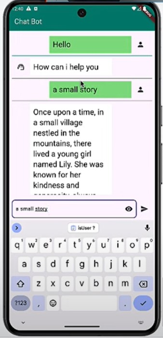

# Application de Chat Bot Flutter avec ChatGPT

Ceci est une **application de Chat Bot basée sur Flutter**, alimentée par **ChatGPT**, qui permet aux utilisateurs d'interagir avec un chatbot intelligent. Le chatbot répond à toutes les questions des utilisateurs une fois qu'ils sont connectés.

---

## Fonctionnalités

- **Authentification des utilisateurs** : Fonctionnalité de connexion pour un accès sécurisé.
- **Chatbot alimenté par l'IA** : Utilise ChatGPT pour fournir des réponses intelligentes et pertinentes.
- **Communication en temps réel** : Interface de chat fluide et réactive.
- **Interface utilisateur intuitive** : Design épuré pour une interaction facile.
- **Évolutif** : Structure modulaire du code pour faciliter les améliorations et intégrations.

---

## Captures d'écran




---

## Installation

Suivez ces étapes pour configurer et exécuter le projet localement :

### Prérequis
- SDK Flutter installé ([Installer Flutter](https://flutter.dev/docs/get-started/install))
- Android Studio ou Visual Studio Code avec les plugins Flutter
- Une clé API OpenAI ([Inscrivez-vous ici](https://platform.openai.com/signup/))

### Étapes

1. **Cloner le dépôt.**

2. **Installer les dépendances** :
   ```bash
   flutter pub get
   ```

3. **Configurer la clé API** :
   - Placez vous dans le fichier `chat.bot.page.dart` du dossier `lib` du projet et remplacez le champ `Authorization` par votre clé API OpenAI :
     ```env
     {
         "Content-Type": "application/json",
         "Authorization":
                         "Bearer votre_cle_api_openai,
     }
     ```
    

4. **Lancer l'application** :
   ```bash
   flutter run
   ```

---

## Technologies utilisées

- **Frontend** : Flutter (Dart)
- **Backend** : API OpenAI ChatGPT

---

## Améliorations futures

- Ajouter la prise en charge de plusieurs langues
- Intégrer des fonctionnalités de conversion voix-texte et texte-voix
- Sauvegarder l'historique des discussions pour les utilisateurs
- Ajouter des thèmes (mode clair/sombre)
- Gestion d'état avec des librairies dédiées

---

## Contact

Pour toute question ou assistance, veuillez contacter :
- **Email** : limsaley@gmail.com

